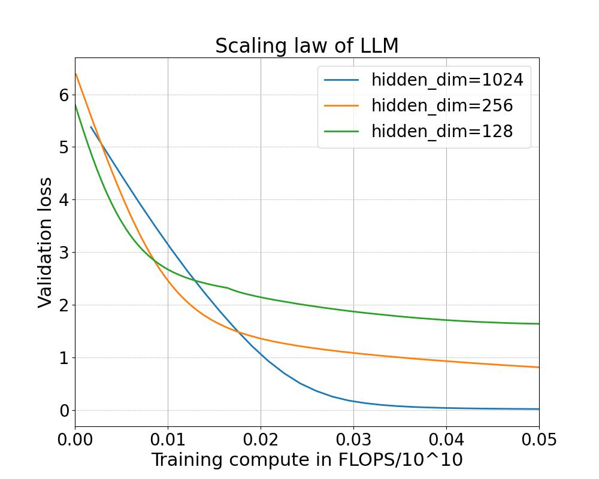

# A new reinforcement learning based algorithm

This repo contains code for an on-going project related to developing a new algorithm for knowledge distillation from a large languge model based on self-play. See below for the details of the project. The code in this repo is still under development and current code can reproduce standard scaling laws for a given language model.

## Review of standard approach
We are presented with a prompt $x$ and a set of $K$ answers with ground truth preference $y_1> \ldots>y_K$. The language model generates response $y$ form $\pi_\theta(y|x)$. We define penalty/error  $E(y|x)$ for response $y$ using the following formula
<table align="center">
<tr><td>

</td></tr>
</table>

Given a permutation $\tau$, the Plackett-Luce model assigns a probability distribution for the generated response of the language model
<table align="center">
<tr><td>
\ldots>y_{\tau(K)}|x)=\prod_{k=1}^{K}\frac{\exp(-E(y_{\tau(k)}|x))}{\sum_{j=k}^{K}\exp(-E(y_{\tau(j)}|x))}" />
</td></tr>
</table>

In usual approach to reinforcement learning we minimize the following objective 
<table align="center">
<tr><td>
y_2>\dots>y_K}\bigl[log\hspace{0.1cm}p(y_1>y_2>\dots>y_K|x)\bigr]" />
</td></tr>
</table>

In Proximal Policy Optimization (PPO) one solves the last equation to get $E$ and then finds the optimal model from the first equation. On the other hand, for Direct Preference Optimization (DPO), first one finds $E$ in terms of $\pi_\theta$ from the first equation and then solves the last equation to find optimal $\pi_\theta$. This leads to the following effective objective
<table align="center">
<tr><td>
\dots>y_K}[log\prod_{k=1}^{K}\frac{e^{T\hspace{0.1cm}log\frac{\pi_{\theta(y_{k}|x)}}{\pi_{ref}(y_{k}|x)}}}{\sum_{j=k}^{K}e^{T\hspace{0.1cm}log\frac{\pi_{\theta}(y_{k}|x)}{\pi_{ref}(y_{k}|x)}}}]" />
</td></tr>
</table>

## The new algorithm
Self-Play Fine-Tuning (SPIN) corresponds to $K=2$. In this case we set $\pi_{ref}=\pi_{\theta(t)}, y_1\sim \pi_{data}(y_1|x), y_2\sim\pi_{\theta(t)}(y_2|x)$. Our method aligned Supervised Fine Tuning (aSFT) corresponds to $K=3$. In this case we set $\pi_{ref}=\pi_{\theta(t)}, y_1\sim \pi_{data}(y_1|x), y_2\sim\pi_{LLM}(y_2|x), y_3\sim\pi_{\theta(t)}(y_3|x)$. Here we are using a larger languge model for assistance in generating $y_2$. 

# Experimental results

## Reproducing known scaling laws

We train a transformer with single heads of head_dim 64, max_seq_len 256, vocab_dim 128256, feed_forward ratio 4 from scratch for various values of hidden_dim. We use a simple addition dataset with 1000 points as the training set. In the plot below we compare the validation loss againt the computational cost in FLOP. The FLOP is calculated after excluding the embedding and logit layers.

    

From the plot we see that given a computational budget, there is an optimal model size.

## Modified scaling laws

Will be updated soon.
